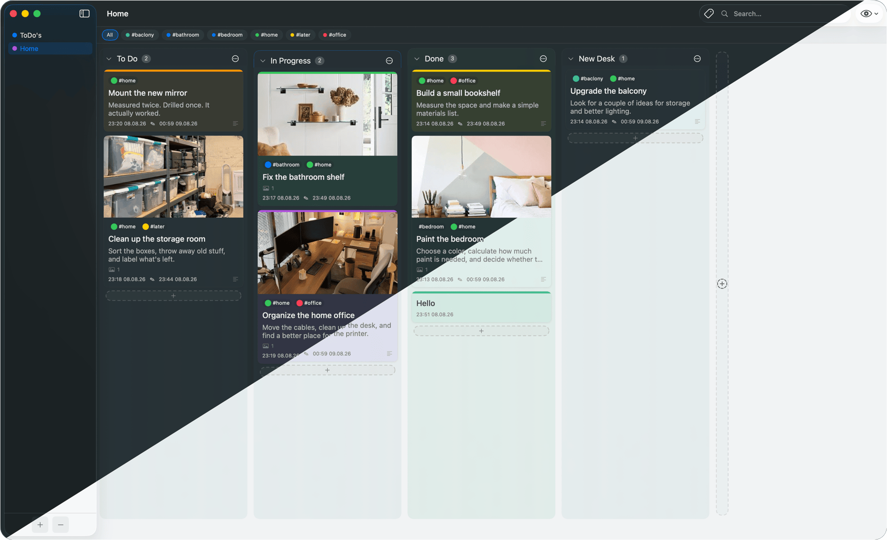

# Just Kanban
Just a Kanban. Nothing more.

A simple, local-first Kanban board manager for macOS 14+.

**All data stays on your Mac. No telemetry. No analytics. No network.**

<iframe width="100%" height="500" src="https://www.youtube.com/embed/gNh9MHnK6lk" title="Just Kanban Demo" frameborder="0" allow="accelerometer; autoplay; clipboard-write; encrypted-media; gyroscope; picture-in-picture" allowfullscreen></iframe>

## I wanted a Kanban app that was actually simple.

Not a project management platform with hundreds of features, complicated workflows, endless settings, and an interface that gets in the way of doing something as simple as moving a card.
Just a board.  
Columns.  
Cards.  
Attachments.  
Search.  
A few things that are genuinely useful.
So I built Just Kanban.
It runs entirely on your Mac. Your data stays with you. There are no accounts, no cloud, no telemetry, no analytics, and no network requests during normal operation.
And there's a slightly unusual detail:
**Just Kanban was built with Just Kanban.**
The first versions were almost empty. I used the app itself to plan and build the app, gradually adding features as I actually needed them. If something didn't make the workflow better, it didn't need to be there.
That's still the idea.
**Keep it useful. Keep it simple.**

## Features

- Boards, columns, cards with tags and attachments
- Drag & drop for cards and columns
- Card search across all boards
- Database export and import
- Automatic local backups
- Adaptive interface size

## Privacy

**Just Kanban does not collect any data. The developer cannot see
your boards, cards, attachments, or any other content you create.**

- No telemetry, no analytics, no crash reporting
- No network requests during normal operation
- No third-party SDKs, no external dependencies
- No cloud sync - your data stays on your Mac

See [PRIVACY.md](PRIVACY.md) for details.

## System Requirements

- macOS 14 Sonoma or newer
- Apple Silicon or Intel

## Installation

1. Download the latest release from the
   [Releases](https://github.com/soulflyu/Just-Kanban/releases) page
2. Open the file
3. Drag `Just Kanban.app` to your Applications folder
4. On first launch, macOS will show a security warning -
   right-click the app and choose "Open"

Detailed instructions: [INSTALL.md](INSTALL.md)

## Security

The application is signed with a self-signed certificate. This means
macOS will show a security warning on first launch. This is normal
for applications without Apple Notarization.

See [SECURITY.md](SECURITY.md) for details and download verification.

## Data Format

Your data is stored as a standard SQLite database. You own your data
completely - export and import via File menu.

See [DATA_FORMAT.md](DATA_FORMAT.md) for technical details.

## License

This software is provided free of charge for personal and commercial
use. Redistribution, resale, or repackaging is prohibited.

See [LICENSE.md](LICENSE.md) for full terms.

## Support the Project
If Just Kanban has been useful to you, consider supporting its development with a donation. 

The project has no monetization, ads, or tracking - every contribution helps.

## Donation Addresses
| Coin            | Network           | Address                                        |
| --------------- | ----------------- | ---------------------------------------------- |
| Bitcoin (BTC)   | Bitcoin           | `bc1q5hclqmup9jj4a9df09qavka86pyumdfq3u9tg8`   |
| Ethereum (ETH)  | Ethereum mainnet  | `0x33167dC18Ff2CD8a364f62423270b2363bA96af1`   |
| Tether (USDT)   | **TRC-20 (Tron)** | `TT8MdwjUDMvvhGggDWWscw9YygV8wDce4H`           |
| USD Coin (USDC) | **Base**          | `0x33167dC18Ff2CD8a364f62423270b2363bA96af1`   |
| Solana (SOL)    | Solana            | `D3aKhUCcdxtWWGYkYE1RCfmXFopzTEKK1nmAAct8d1tL` |

Full terms and warnings: see [DONATE.md](DONATE.md).

Donations are completely optional. They do not unlock features, provide priority support, or influence the roadmap.

[Report a bug or request a feature](https://github.com/soulflyu/Just-Kanban/issues)

[View releases](https://github.com/soulflyu/Just-Kanban/releases)
